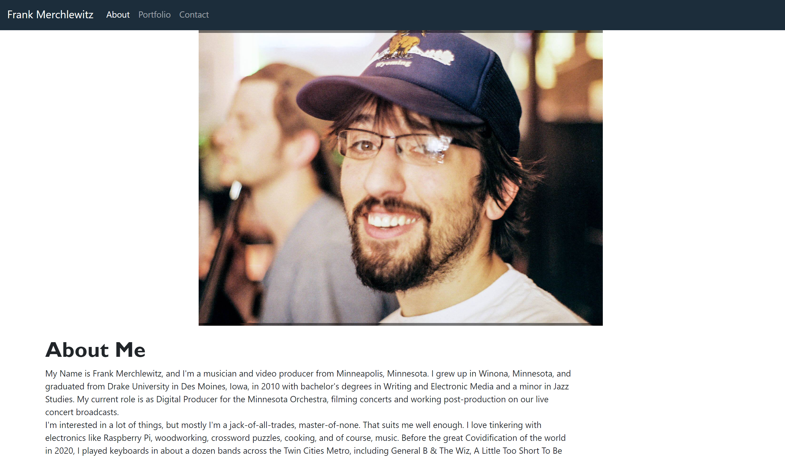

# React-Portfolio
Rebuilding Portfolio using React

[Live Demo](
https://frank-merk.github.io/react-portfolio/#/)

## Technologies used

* React Framework
* Github pages deployment
* Bootstrap

## Description

This week's homework assignment was to re-factor my personal portfolio using the react framework and components.

## Installation

First, install dependendencies:

`npm install`

To run the application from the terminal, you will enter:

`npm start`

## Strategy

I used some bootstrap examples to get started replicating my layout. It was helpful to build out the components first, then pages with placeholder code from the previous iterations of this portfolio project. Then it was jus ta matter of injecting content by changing some syntax and incorporating components to the pages.

## Challenges

The biggest challenge for this project was getting the bootstrap grid components working. Since I had so many different grid formats specifically on the portfolio page, it proved difficult to render things cleanly, especially because I had so many different project types. Another thing I had to sacrifice was my hero background image - there was a method that worked ok using react-native, but overall, I thought it looked like a clunky replacement, so I added it to the icebox.

## License

[Apache 2.0](https://opensource.org/licenses/Apache2.0)

## Questions

For further questions, contact here:
* Email Address: jlimhb@gmail.com
* GitHub: [frank-merk](https://github.com/frank-merk)
